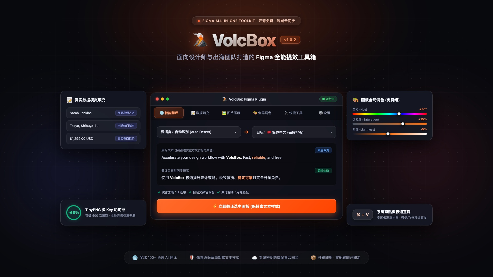

# 🌋 VolcBox — Figma 全能提效工具箱

### 告别机械重复劳动 · 把几十分钟的脏活累活压缩到 10 秒钟

**开源免费 · 开箱即用 · 跨端云同步**

 

[🌐 访问官方主页](https://figma-volcbox.pages.dev) · [📦 下载插件安装包 (.zip)](https://figma-volcbox.pages.dev/VolcBox_v1.0.2.zip) · [🐛 提交反馈 / Issue](https://github.com/walkyufeng-hue/Figma-VolcBox/issues)

 

---

  

---

## 📢 最近更新 · v1.0.2 版本动态

> 💡 **告别翻译报错中断与卡顿**：本版本重点解决混合字体富文本兼容性，并大幅优化大型画板图层处理速度。

| 模块 | 🎯 更新亮点 | ⚡ 实际设计收益 |
| :--- | :--- | :--- |
| 🛡️ **富文本翻译** | **彻底解决混合字体报错** 修复多字重/多字体文本在批量翻译或填充时抛出 `Cannot set characters on a TextNode with mixed fonts` 的问题，翻译前智能预设字体族。 | 面对设计师手搓混排的复杂画板，翻译 100% 稳妥通过，绝不中断闪退。 |
| ⚡ **性能提速** | **排版计算提速 80%+** 重构行高规范与字体分析算法，由原逐字扫描加载优化为基于 Font Set 去重并发加载。 | 处理包含成百上千个图层的大型项目时，秒级即刻完成响应。 |
| 🔄 **历史撤销** | **优化 Undo / Redo 回退恢复** 微调历史栈回退逻辑与字体样式还原机制。 | 撤销翻译或调色时，图层样式与字阶精准还原，杜绝样式错乱。 |
| 🎨 **视觉呈现** | **README 与 1080P 高清封面焕新** 全篇文案重构为“痛点 vs 收益”导向，文案通风精炼，换装 1080P 现代暗黑质感封面。 | 团队新人与协作伙伴 10 秒看懂核心价值，沟通零门槛。 |

---

## 🎯 痛点 vs 收益：VolcBox 能帮你省下多少时间？

| 😫 日常机械痛点 | ✨ VolcBox 秒级解决方案 |
| :--- | :--- |
| **🌐 多语言本地化改到崩溃** 复制到网页翻译再粘回，加粗全丢、颜色全乱、格式重排半天 | **1 键翻译 100+ 语种 · 富文本 1:1 保真** 局部加粗、下划线、变色精准保留，画板原地翻译或克隆对照 |
| **📝 原型手编假数据耗时又掉价** 满屏手打 "Text"、"123"、"张三"，编造名字与价格枯燥耗神 | **1 秒批量注入真实业务数据** 高频人名、全球城市、电商真实价格一键填充，自动规范图层名 |
| **🎨 尝试多套主题色解组到头秃** 换套配色或暗色系，嵌套 Frame 必须层层解组修改 Fill | **免解组画板全局调色** 滑动 HSL 轨道实时推演，支持仅作用于填充或描边，3 秒看效果 |
| **💬 拼长图发群沟通太繁琐** 逐个画板切图导出，再找外部工具拼长图拖入微信/飞书汇报 | **微信 / 飞书 ⌘+V 秒级直发** 后台静默拼图直接写入系统剪贴板，切到聊天窗口直接粘贴高清大图 |

 

### 🛠️ 更多实用提效能力

- 🖼️ **TinyPNG 账号池压缩**：多 API Key 自动轮询调度突破 500 次限额，零 Key 时无损离线引擎兜底，体积立减 70%+。
- 📐 **文本行高一键规范**：批量将画板文本行高转为 Auto，杜绝文本框上下溢出与重叠。
- ☁️ **跨设备配置秒同步**：专属独立密钥加密备份，换电脑无需重复配置 API Key 与词库。

---

## 🚀 极速上手（3 步搞定）

1. **下载安装包**：
   直接下载最新 [VolcBox_v1.0.2.zip](https://figma-volcbox.pages.dev/VolcBox_v1.0.2.zip) 并解压到本地（或 `git clone https://github.com/walkyufeng-hue/Figma-VolcBox.git`）；
2. **在 Figma 中导入**：
   Figma 菜单：`Plugins` ➔ `Development` ➔ `Import plugin from manifest...`，选中目录中的 **`manifest.json`**；
3. **即刻提效**：
   在画布中选中任意画板或图层，随时运行 VolcBox！

---

## 📌 适用人群 & 兼容性

| 🎯 适用人群 | ⚠️ 兼容性与提示 |
| :--- | :--- |
| • **UI / UX 设计师**：痛恨机械重复改文字与造假数据 • **出海与跨境团队**：面临大量多语言本地化排版挑战 • **独立开发者 / 创作者**：需要秒出高逼真原型对齐方案 | • **平台**：完美支持 Figma 桌面客户端（macOS / Win）及 Web 端 • **图层**：仅作用于未锁定的 `TEXT` 文本与画板图层 • **剪贴板**：桌面端支持系统剪贴板直拷，Web 端生成画布拼图 |

---

## 🌐 官方主页与生态

- 🔗 **官方主页**：[https://figma-volcbox.pages.dev](https://figma-volcbox.pages.dev)
- 📦 **Releases 发版**：[GitHub Releases](https://github.com/walkyufeng-hue/Figma-VolcBox/releases)
- 💬 **问题反馈**：[GitHub Issues](https://github.com/walkyufeng-hue/Figma-VolcBox/issues)

---

## 📄 开源协议

本项目基于 [MIT License](LICENSE) 协议开源。
